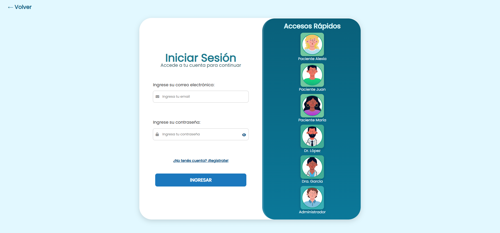
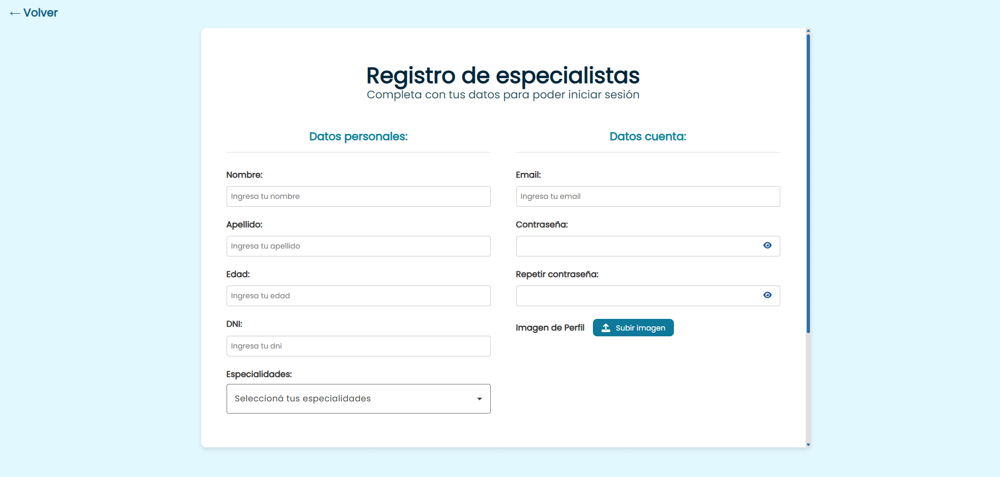
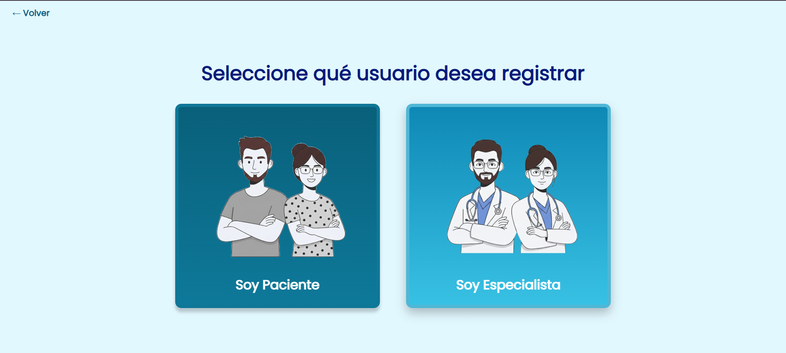
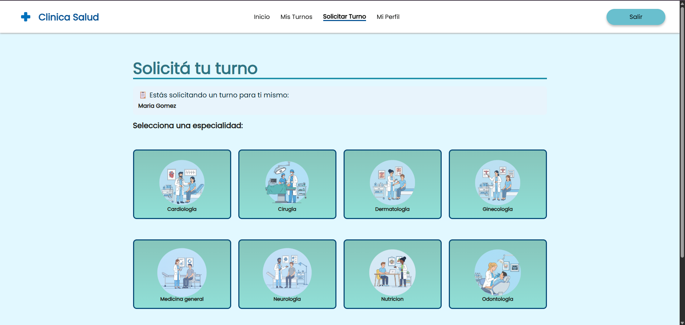
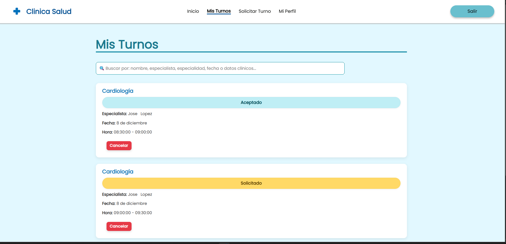
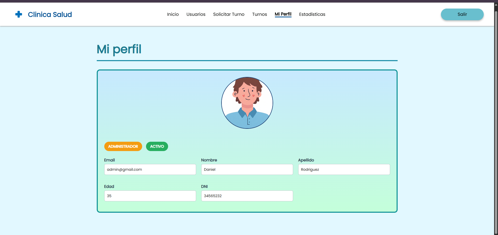
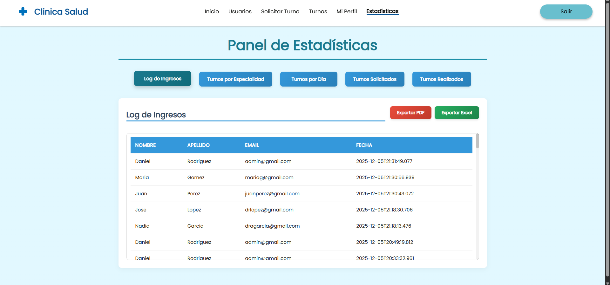
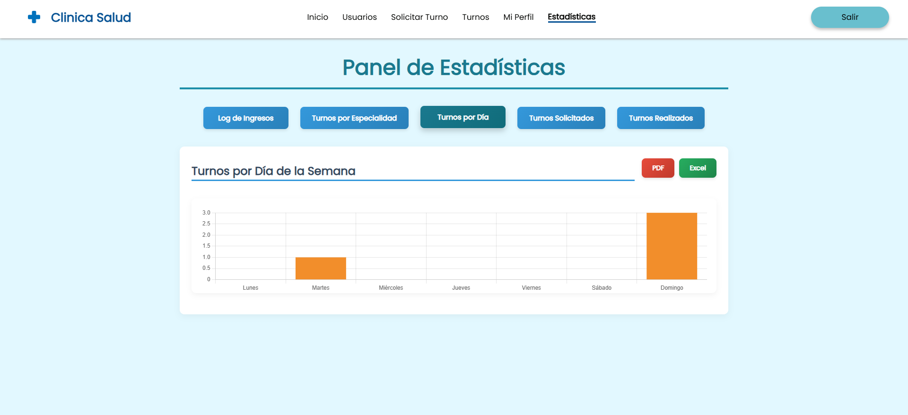

#  Clínica Online - README

## Descripción
Plataforma web para gestión de clínica: registro de pacientes y especialistas, administración de usuarios, turnos, historia clínica y estadísticas.  
Incluye validaciones, seguridad con captcha, animaciones de transición y descargas en PDF/Excel.

---

##  Sprint 1 - Registro y Usuarios

### Funcionalidades
- **Página de bienvenida**: accesos a login y registro.
- **Registro**:
  - Pacientes: Nombre, Apellido, Edad, DNI, Obra Social, Mail, Contraseña, 2 imágenes de perfil.
  - Especialistas: Nombre, Apellido, Edad, DNI, Especialidad (selección o nueva), Mail, Contraseña, Imagen de perfil.
- **Login**:
  - Acceso rápido.
  - Pacientes: ingreso solo si verificaron mail.
- **Usuarios (solo Administrador)**:
  - Ver información de usuarios.
  - Habilitar/inhabilitar especialistas.
  - Crear nuevos usuarios (Paciente, Especialista, Administrador).

---

##  Sprint 2 - Turnos

### Funcionalidades
- **Mis Turnos**:
  - Paciente: ver turnos solicitados, filtrar por Especialidad/Especialista (sin combobox).  
    Acciones según estado: cancelar, ver reseña, completar encuesta, calificar atención.
  - Especialista: ver turnos asignados, filtrar por Especialidad/Paciente.  
    Acciones: cancelar, rechazar, aceptar, finalizar (con reseña), ver reseña.
- **Turnos (Administrador)**:
  - Ver todos los turnos, filtrar por Especialidad/Especialista.
  - Cancelar turnos.
- **Solicitar Turno**:
  - Paciente/Administrador: seleccionar Especialidad, Especialista, día y horario (próximos 15 días).
  - Administrador: asignar paciente.
  - No usar Datepicker.
- **Mi Perfil**:
  - Datos del usuario.
  - Mis horarios (solo Especialista): marcar disponibilidad por especialidad.

##  Sprint 3 - Historia Clínica

### Funcionalidades
- **Historia Clínica**:
  - Visible en: Mi Perfil (Paciente), Usuarios (Administrador), Pacientes (Especialista).
  - Cargada por Especialista al finalizar atención.
  - Datos fijos: Altura, Peso, Temperatura, Presión.
  - Máx. 3 datos dinámicos (clave/valor).
- **Filtro de turnos mejorado**:
  - Buscar por cualquier campo, incluyendo historia clínica.

  

---

##  Sprint 4 - Estadísticas

### Funcionalidades
- **Informes (Administrador)**:
  - Log de ingresos al sistema (usuario, día, hora).
  - Cantidad de turnos por especialidad.
  - Cantidad de turnos por día.
  - Turnos solicitados por médico en un lapso.
  - Turnos finalizados por médico en un lapso.
- Descarga de gráficos  en Excel o PDF.

##  Sprint 5 - Mejoras
### Requerimientos mínimos
- Nuevos datos dinámicos en historia clínica:
  - Control de rango (0–100).
  - Cuadro de texto numérico.
  - Switch Sí/No.
- Directiva de captcha propio:
  - Opción de deshabilitar captcha.
- Animaciones de transición:
  -Animaciones entre componentes.

---

## 🎯 Conclusión
Este sistema evoluciona sprint a sprint, pasando de lo básico (registro y login) a funcionalidades avanzadas como historia clínica, estadísticas y seguridad con captcha.  
Cada entrega suma valor y robustez a la plataforma.

